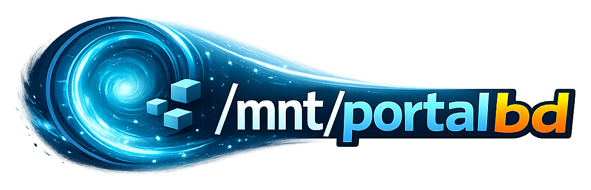

<div align="center">

# portalbd

portalbd is a **Network Block Device (NBD) server** backed by object storage,
turning any filesystem into a portal to bottomless storage with atomic
snapshots for point-in-time recovery.



[Key features](#key-features) •
[Usage](#usage) •
[Configuration](#usage) •
[Installation](#installation) •
[Development Workflow](#development-workflow)

</div>

## Key Features

- **Object Storage**: Supports any S3-like object storage
- **Atomic Snapshots**: Snapshot creation via [SlateDB] checkpoints
- **Point-in-Time Recovery**: Restore to a snapshot on any filesystem
- **CSI Driver**: portalbd-csi provides a CSI implementation for k8s
- **NixOS Modules**: NixOS modules for easy NixOS integration

## Usage

Creating an exabyte-scale ZFS pool:

```sh
# As root, start portalbd with a 1 exbibyte (EiB) device
$ portalbd --disk-size-gb 1073741824
2026-01-07T02:58:02.651290Z  INFO portalbd::store::block_store: Applying LSM configuration compression=Some(Lz4) block_size=Some(Block64Kib)
2026-01-07T02:58:02.656116Z  INFO portalbd: portalbd started socket=/run/portalbd/portalbd.sock size_gb=1073741824 nbd=127.0.0.1:10809 storage="memory://" recording=false
2026-01-07T02:58:02.656272Z  INFO portalbd: NBD server listening address=127.0.0.1:10809
2026-01-07T02:58:02.656281Z  INFO portalbd::daemon: NBD server accepting connections export=portalbd size_bytes=1152921504606846976

# On another terminal connect to the NBD server
$ nbd-client -N portalbd 127.0.0.1 10809 /dev/nbd0
Negotiation: ..size = 1099511627776MB
Connected /dev/nbd0

# Create a ZFS pool with mountpoint /mnt/portal
$ zpool create -m /mnt/portal portal /dev/nbd0

# A 1.0E ZFS pool
$ df -h /mnt/portal
Filesystem      Size  Used Avail Use% Mounted on
portal          1.0E  128K  1.0E   1% /mnt/portal

# Unmount & disconnect NBD client
$ zpool export portal
$ nbd-client -d /dev/nbd0
```

ext4 with atomic snapshots:

```sh
$ ./target/release/portalbd
2026-01-07T03:24:05.229739Z  INFO portalbd::store::block_store: Applying LSM configuration compression=Some(Lz4) block_size=Some(Block64Kib)
2026-01-07T03:24:05.230178Z  INFO portalbd: portalbd started socket=/run/portalbd/portalbd.sock size_gb=1 nbd=127.0.0.1:10809 storage="memory://" recording=false
2026-01-07T03:24:05.230219Z  INFO portalbd: NBD server listening address=127.0.0.1:10809
2026-01-07T03:24:05.230230Z  INFO portalbd::daemon: NBD server accepting connections export=portalbd size_bytes=1073741824

$ nbd-client -N portalbd 127.0.0.1 10809 /dev/nbd0
Negotiation: ..size = 1024MB
Connected /dev/nbd0

$ mkfs.ext4 /dev/nbd0
mke2fs 1.47.3 (8-Jul-2025)
Discarding device blocks: done
Creating filesystem with 262144 4k blocks and 65536 inodes
Filesystem UUID: 79733ddd-d9af-45fa-aa96-597f89c6e787
Superblock backups stored on blocks:
        32768, 98304, 163840, 229376

Allocating group tables: done
Writing inode tables: done
Creating journal (8192 blocks): done
Writing superblocks and filesystem accounting information: done

$ mount /dev/nbd0 /mnt/portal

# Write some data & sync
$ echo "important data" > /mnt/portal/data
$ sync /mnt/portal

# Create a snapshot
$ portalctl snapshot create before-disaster
Snapshot: before-disaster
  ID:      4b1461d3-81c7-4709-8205-b1b2578503d6
  Created: SystemTime { tv_sec: 1767755083, tv_nsec: 0 }

# Delete data
$ rm /mnt/portal/data
$ ls -la /mnt/portal
total 1
drwxr-xr-x 2 root root 2 Jan  6 22:05 .
drwxr-xr-x 3 root root 3 Jan  6 21:15 ..

# Unmount zpool, restore snapshot, and remount
$ zpool export portal
$ portalctl snapshot restore before-disaster
OK
$ zpool import portal

# Data is restored
$ cat /mnt/portal/data
important data
```

## Configuration

```toml
[device]
disk_size_gb = 10

[storage]
url = "s3://bucket/path"
# (omit for in-memory)

[nbd]
address = "127.0.0.1:10809"
socket = "/run/portalbd/portalbd.sock"

[lsm]
flush_interval_ms = 1000
l0_sst_size_bytes = 67108864
```

**Storage backend resolution:**

| URL Scheme | Backend |
|------------|---------|
| `file://path` | LocalFileSystem |
| `s3://bucket/path` | AmazonS3 (with conditional put) |
| (none) | InMemory |

## Installation

A [NixOS][nixos] module is provided for easy installation.

- **NixOS**

  <details>
  <summary>Flake</summary>

  ```nix
  {
    inputs = {
      nixpkgs.url = "github:NixOS/nixpkgs/nixos-unstable";
      portalbd = {
        url = "github:hinshun/portalbd";
        inputs.nixpkgs.follows = "nixpkgs";
      };
    };

    outputs = { nixpkgs, portalbd, ... }: {
      nixosConfigurations.myhost = nixpkgs.lib.nixosSystem {
        system = "x86_64-linux";
        modules = [
          ./hardware-configuration.nix
          ({ pkgs, ... }: {
            # (1) Import nixos module.
            imports = [ portalbd.nixosModules.default ];

            # (2) Add overlay.
            nixpkgs.overlays = [ portalbd.overlays.default ];

            # (3) Enable portalbd instance.
            services.portalbd.instances.main = {
              enable = true;
              settings = {
                device.disk_size_gb = 100;
                storage.url = "s3://my-bucket/portalbd";
                nbd.address = "127.0.0.1:10809";
              };
              # Optional: environment file for cloud credentials
              # environmentFile = "/run/secrets/portalbd-env";
            };

            # (4) Add nbd-client for connecting to the NBD server.
            environment.systemPackages = [ pkgs.nbd ];
          })
        ];
      };
    };
  }
  ```
  </details>

  <details>
  <summary>Non-flake</summary>

  ```nix
  { pkgs, ... }:
  let
    portalbd = import (
      builtins.fetchTarball "https://github.com/hinshun/portalbd/archive/main.tar.gz"
    );

  in {
    imports = [
      ./hardware-configuration.nix
      # (1) Import nixos module.
      portalbd.nixosModules.default
    ];

    # (2) Add overlay.
    nixpkgs.overlays = [ portalbd.overlays.default ];

    # (3) Enable portalbd instance.
    services.portalbd.instances.main = {
      enable = true;
      settings = {
        device.disk_size_gb = 100;
        storage.url = "s3://my-bucket/portalbd";
        nbd.address = "127.0.0.1:10809";
      };
      # Optional: environment file for cloud credentials
      # environmentFile = "/run/secrets/portalbd-env";
    };

    # (4) Add nbd-client for connecting to the NBD server.
    environment.systemPackages = [ pkgs.nbd ];
  }
  ```
  </details>

## Development Workflow

### Building

```bash
cargo build          # Debug build
cargo build --release # Release build
```

### Unit Tests

Each module has unit tests. Run with:

```bash
cargo test
```

### Deterministic Simulation Testing (DST)

DST runs many rounds of simulations and verifies state continues to be correct.

```bash
# Short run
RUSTFLAGS="--cfg tokio_unstable" cargo test -p portalbd-dst

# Long run with specific SEED
RUSTFLAGS="--cfg tokio_unstable" DST_SEED=12345 cargo test -p portalbd-dst -- --ignored
```

### Integration tests via NixOS VM tests

```bash
nix run .#test-basic              # Basic read/write/persistence
nix run .#test-snapshot-semantics # Snapshot create/restore/delete
nix run .#test-csi-k3s            # CSI driver works with k3s
```

### Benchmarking

Trace replay runs recorded workloads against portalbd. First, generate traces
via NixOS VM tests:

```bash
nix run .#test-trace-mkfs       # Filesystem creation (sequential writes)
nix run .#test-trace-pgbench    # PostgreSQL benchmark (flush-heavy)
nix run .#test-trace-minecraft  # Game server (write-heavy)
```

Traces are saved to `target/traces/`. Run benchmarks:

```bash
cargo run -p portalbd-trace --bin trace-bench --release -- \
    --all target/traces/ --iterations 3 --warmup 1
```

CPU profiling with flamegraph:

```bash
cargo run -p portalbd-trace --bin trace-bench --release -- \
    target/traces/minecraft.trace.json --profile --profile-dir target/profiles
```

[SlateDB]: https://github.com/slatedb/slatedb
[nixos]: https://zero-to-nix.com/concepts/nixos
